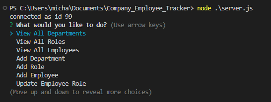
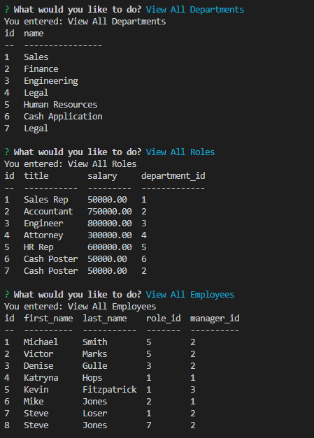

# Company_Employee_Tracker

 ## Table-of-Contents

  * [Description](#description)
  * [Installation](#installation)
  * [Usage](#usage)
  * [License](#license)
  * [Contributing](#contributing)
  * [Links](#questions)
  
  ## [Description](#table-of-contents)
  This Company Employee Tracker will allow a business to manage the departments, roles, and employees all from the command-line to organize and plan the business. 

  ## [Installation](#table-of-contents)
  You can clone the copy the code from the github repository and clone it on your computer. Open the file in VS Code and make sure you're on the Company_Employee_Tracker. You will need inquirer, mysql2 and console.table.

  ## [Usage](#table-of-contents)
  Once in VS Code, you will want to open server.js in an Integrated Terminal. Type in "Node server.js" and hit Enter. On this screen you will be able to select what you want to view/update. You can "View All Departments", "View All Roles", "View All Employees", "Add Department", "Add Role", "Add Employee", or "Update Employee Role". If you select any of the Add or Update options you will be required to enter more information to update the tables. Once finished, you can select the quit optiont to end the application. 

  

  

  
  ## [license](#table-of-contents)
  MIT License

  ## [Contributing](#table-of-contents)
  Contributions will not be accepted at this time.

  ## [Links](#table-of-contents)

  Please contact me using the following links:

  [GitHub](https://github.com/mikestem)

  [Walk Through Video](https://drive.google.com/file/d/1WxwWA2kPqUVAMZrM4EXWHz99AikiHmb-/view)

